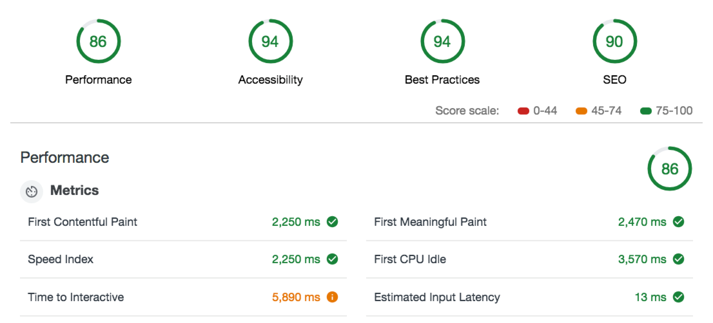

# Mobile Web Specialist Certification Course
---
#### _Three Stage Course Material Project - Restaurant Reviews_

## Project Overview: Stage 1

For the **Restaurant Reviews** projects, you will incrementally convert a static webpage to a mobile-ready web application. In **Stage One**, you will take a static design that lacks accessibility and convert the design to be responsive on different sized displays and accessible for screen reader use. You will also add a service worker to begin the process of creating a seamless offline experience for your users.

### Specification

You have been provided the code for a restaurant reviews website. The code has a lot of issues. It’s barely usable on a desktop browser, much less a mobile device. It also doesn’t include any standard accessibility features, and it doesn’t work offline at all. Your job is to update the code to resolve these issues while still maintaining the included functionality. 

### What do I do from here?

1. I installed eslint and audacity eslint for linting and formatting check.  I also added browser-sync. Just type `npm install`, and you will be ready. 

In a terminal, to run browser sync for js files, type, ```browser-sync start --server --files "js/*.js"
```  To run css files type ```browser-sync start --server --files "css/*.css"

2. With your server running, visit the site: `http://localhost:3000`, and look around for a bit to see what the current experience looks like.
3. Explore the provided code, and start making a plan to implement the required features in three areas: responsive design, accessibility and offline use.
4. Write code to implement the updates to get this site on its way to being a mobile-ready website.

## Leaflet.js and Mapbox:

This repository uses [leafletjs](https://leafletjs.com/) with [Mapbox](https://www.mapbox.com/). You need to replace `<your MAPBOX API KEY HERE>` with a token from [Mapbox](https://www.mapbox.com/). Mapbox is free to use, and does not require any payment information. 

### Note about ES6

Most of the code in this project has been written to the ES6 JavaScript specification for compatibility with modern web browsers and future proofing JavaScript code. As much as possible, try to maintain use of ES6 in any additional JavaScript you write. 



## Credits
- I used this website to figure out how to setup gh-pages [click here](https://www.youtube.com/watch?v=6O6RWm-llSM)
- I used this page to find out about the eslint npm package for Udacity and how to set it up. [click here](https://www.npmjs.com/package/eslint-config-udacity)
- I used this page to get more info on setting up a service worker and caching. [click here](https://www.youtube.com/watch?v=ksXwaWHCW6k&feature=youtu.be)


